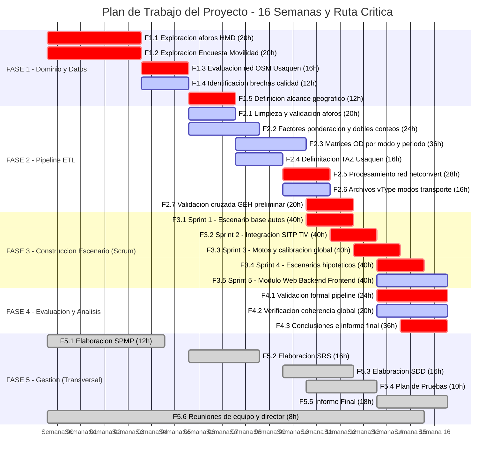

```mermaid
gantt
    title Plan de Trabajo del Proyecto - 16 Semanas y Ruta Critica
    dateFormat  YYYY-MM-DD
    axisFormat  Semana %W

    section FASE 1 - Dominio y Datos
    F1.1 Exploracion aforos HMD (20h)             :crit, f11, 2026-01-01, 4w
    F1.2 Exploracion Encuesta Movilidad (20h)      :crit, f12, 2026-01-01, 4w
    F1.3 Evaluacion red OSM Usaquen (16h)          :crit, f13, 2026-01-29, 2w
    F1.4 Identificacion brechas calidad (12h)      :active, f14, 2026-01-29, 2w
    F1.5 Definicion alcance geografico (12h)       :crit, f15, 2026-02-12, 2w

    section FASE 2 - Pipeline ETL
    F2.1 Limpieza y validacion aforos (20h)        :active, f21, 2026-02-12, 2w
    F2.2 Factores ponderacion y dobles conteos (24h) :active, f22, 2026-02-12, 3w
    F2.3 Matrices OD por modo y periodo (36h)    :active, f23, 2026-02-26, 3w
    F2.4 Delimitacion TAZ Usaquen (16h)            :active, f24, 2026-02-26, 2w
    F2.5 Procesamiento red netconvert (28h)        :crit, f25, 2026-03-12, 2w
    F2.6 Archivos vType modos transporte (16h)     :active, f26, 2026-03-12, 2w
    F2.7 Validacion cruzada GEH preliminar (20h)   :crit, f27, 2026-03-19, 2w

    section FASE 3 - Construccion Escenario (Scrum)
    F3.1 Sprint 1 - Escenario base autos (40h)       :crit, f31, 2026-03-19, 2w
    F3.2 Sprint 2 - Integracion SITP TM (40h)       :crit, f32, 2026-03-26, 2w
    F3.3 Sprint 3 - Motos y calibracion global (40h) :crit, f33, 2026-04-02, 2w
    F3.4 Sprint 4 - Escenarios hipoteticos (40h)    :crit, f34, 2026-04-09, 2w
    F3.5 Sprint 5 - Modulo Web Backend Frontend (40h):active, f35, 2026-04-09, 3w

    section FASE 4 - Evaluacion y Analisis
    F4.1 Validacion formal pipeline (24h)         :crit, f41, 2026-04-09, 3w
    F4.2 Verificacion coherencia global (20h)      :active, f42, 2026-04-09, 3w
    F4.3 Conclusiones e informe final (36h)        :crit, f43, 2026-04-16, 2w

    section FASE 5 - Gestion (Transversal)
    F5.1 Elaboracion SPMP (12h)                    :done, f51, 2026-01-01, 5w
    F5.2 Elaboracion SRS (16h)                     :done, f52, 2026-02-12, 3w
    F5.3 Elaboracion SDD (16h)                     :done, f53, 2026-03-12, 3w
    F5.4 Plan de Pruebas (10h)                     :done, f54, 2026-03-19, 3w
    F5.5 Informe Final (18h)                       :done, f55, 2026-04-09, 3w
    F5.6 Reuniones de equipo y director (8h)       :done, f56, 2026-01-01, 16w
```
