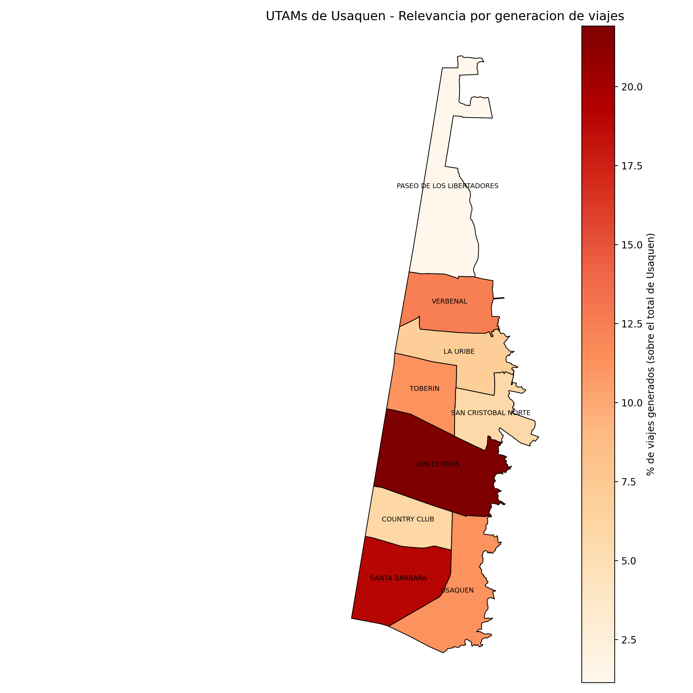

# Análisis complementario a Usaquén: distribución de viajes por localidad e impacto de UTAM

**Issues :** #18, #19
**Autor:** Felipe

---

## 1. Contexto

Este reporte extiende el análisis realizado en el informe F1.4 (identificación de brechas de datos y calidad para Usaquén), cubriendo dos análisis solicitados como continuación:

- **Issue #18:** porcentaje de viajes de las demás localidades de Bogotá, para contextualizar el peso relativo de Usaquén dentro de la ciudad.
- **Issue #19:** impacto espacial y funcional de las UTAM (Unidades de Transporte y Análisis de Movilidad) dentro de Usaquén.

Todos los porcentajes se calcularon usando el **factor de expansión de viajes (`fexp_vj`)** de la encuesta, no el conteo crudo de registros. Esto es necesario porque cada viaje encuestado representa un número distinto de viajes reales en la ciudad; ponderar por `fexp_vj` es lo que permite que los resultados reflejen la población real de Bogotá y no solo la muestra.

---

## 2. Issue #18 — Porcentaje de viajes por localidad

Se calculó, para cada una de las 20 localidades de Bogotá, el porcentaje de viajes **generados** (origen) y **atraídos** (destino) sobre el total de viajes registrados en la encuesta con localidad válida en Bogotá (se excluyeron los viajes con destino/origen fuera de la ciudad, categoría "No aplica" en la encuesta).

### 2.1 Resultado principal

| Localidad | % viajes origen | % viajes destino | Dif. vs. Usaquén (origen) |
|---|---|---|---|
| Kennedy | 13.03% | 12.99% | +5.39 |
| Suba | 12.40% | 12.37% | +4.76 |
| Bosa | 9.51% | 9.52% | +1.87 |
| Engativá | 7.77% | 7.79% | +0.13 |
| **Usaquén** | **7.64%** | **7.65%** | **—** |
| Ciudad Bolívar | 7.34% | 7.31% | -0.30 |
| Chapinero | 5.99% | 6.08% | -1.65 |
| Fontibón | 4.50% | 4.33% | -3.14 |
| Puente Aranda | 4.12% | 4.17% | -3.52 |
| Teusaquillo | 3.94% | 4.02% | -3.70 |
| Usme | 3.82% | 3.76% | -3.82 |
| Rafael Uribe Uribe | 3.70% | 3.69% | -3.94 |
| San Cristóbal | 3.40% | 3.30% | -4.24 |
| Barrios Unidos | 3.05% | 3.09% | -4.59 |
| Santa Fe | 2.79% | 2.82% | -4.85 |
| Tunjuelito | 2.40% | 2.41% | -5.24 |
| Los Mártires | 2.01% | 2.07% | -5.63 |
| Antonio Nariño | 1.72% | 1.74% | -5.92 |
| Candelaria | 0.84% | 0.86% | -6.80 |
| Sumapaz | 0.03% | 0.03% | -7.61 |

*(tabla completa disponible en `resultado_issue18_viajes_por_localidad.xlsx`)*

### 2.2 Interpretación

- **Kennedy y Suba** concentran, cada una, cerca del doble del peso de Usaquén en generación y atracción de viajes — son las localidades con mayor volumen de movilidad de toda la ciudad.
- **Usaquén se ubica en un rango medio** (7.64% origen / 7.65% destino), con una diferencia mínima entre viajes generados y atraídos, lo que sugiere que la localidad funciona de forma relativamente equilibrada (no es predominantemente "dormitorio" ni predominantemente "receptora" de viajes).
- **Sumapaz** es prácticamente insignificante en la muestra (0.03%), coherente con su baja densidad poblacional y su carácter rural.

---

## 3. Issue #19 — Impacto de las UTAM en Usaquén

Usaquén está conformada por **9 UTAM**. Se analizó cada una en dos dimensiones:

1. **Peso espacial:** porcentaje de área que ocupa cada UTAM sobre el área total de la localidad (shapefile oficial `UTAM2023`).
2. **Peso funcional:** porcentaje de viajes generados (origen) que salen de cada UTAM, ponderado por `fexp_vj`.

### 3.1 Resultado principal

| UTAM | Nombre | Área (ha) | % área Usaquén | % viajes generados |
|---|---|---|---|---|
| UTAM13 | Los Cedros | 671.4 | 17.66% | **21.92%** |
| UTAM16 | Santa Bárbara | 458.1 | 12.05% | 19.05% |
| UTAM9 | Verbenal | 355.3 | 9.35% | 12.44% |
| UTAM14 | Usaquén | 492.0 | 12.94% | 11.24% |
| UTAM12 | Toberín | 290.3 | 7.63% | 11.15% |
| UTAM10 | La Uribe | 344.8 | 9.07% | 6.92% |
| UTAM15 | Country Club | 285.2 | 7.50% | 5.85% |
| UTAM11 | San Cristóbal Norte | 274.9 | 7.23% | 5.63% |
| UTAM1 | Paseo de los Libertadores | 630.1 | 16.57% | 1.14% |

*(tabla completa en `resultado_issue19_utam_usaquen.xlsx`)*

> **Nota:** 50,094 viajes expandidos con origen en Usaquén corresponden a la Unidad de Planeamiento Rural (código `UPR0002`, sector rural de los cerros), que no tiene polígono en el shapefile de UTAM y por tanto no se incluye en la comparación anterior.

### 3.2 UTAM más relevante: Los Cedros

**Los Cedros (UTAM13)** es la UTAM más relevante de Usaquén: concentra la mayor extensión territorial (17.66% del área de la localidad) **y** la mayor generación de viajes (21.92% del total), lo que la convierte en la zona de mayor actividad de movilidad dentro de Usaquén.

En contraste, **Paseo de los Libertadores (UTAM1)**, aunque tiene una extensión considerable (16.57% del área), genera un porcentaje mínimo de viajes (1.14%) — corresponde a la franja rural/norte de la localidad, con baja densidad de actividad.

### 3.3 Mapa

*Las UTAM en tonos más oscuros (Los Cedros, Santa Bárbara) concentran mayor porcentaje de viajes generados; las de tonos claros (Paseo de los Libertadores, Country Club) tienen menor actividad relativa.*

---

## 4. Archivos generados

| Archivo | Contenido |
|---|---|
| `analisis_viajes_localidades.py` | Script issue #18 |
| `resultado_issue18_viajes_por_localidad.xlsx` | Resultados issue #18 (% origen, % destino, comparación vs. Usaquén) |
| `analisis_utam_usaquen.py` | Script issue #19 |
| `resultado_issue19_utam_usaquen.xlsx` | Resultados issue #19 (área y viajes por UTAM) |
| `mapa_utam_usaquen.png` | Mapa de UTAMs de Usaquén por relevancia |
